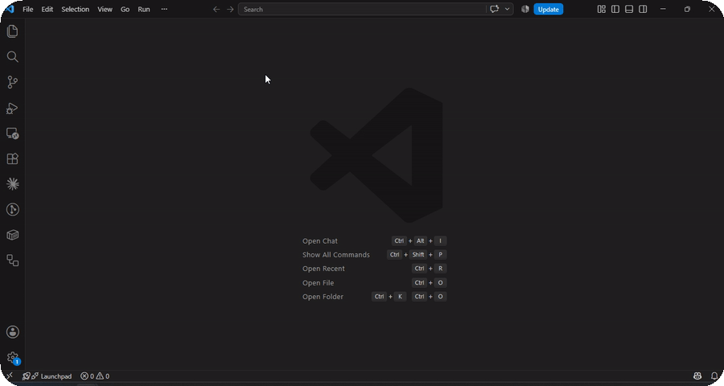

# Paste. Format. Done.

```text
Ctrl+N
Paste
Shift+Alt+F
Formatted
```

**Plaintext Formatter** detects pasted code and makes VS Code's native **Format Document** work in an unsaved **Plain Text** tab. It tries VS Code and installed formatters first, validates the result, and leaves your tab's language alone. No saving, language picker, setup, or special command required.



Select a snippet and use **Format Selection** to format only that selection. For prose containing several code blocks, use **Plaintext Formatter: Format Detected Code Blocks** from the Command Palette.

## Install and use

Build a local package with `npm ci` and `npm run package`, then choose **Extensions: Install from VSIX…** in VS Code and select `plaintext-formatter-0.1.0.vsix`. This repository does not imply that a Marketplace release has been published.

1. Open a new text tab (`Ctrl+N`; `Cmd+N` on macOS).
2. Paste a supported snippet, leaving Language Mode as **Plain Text**.
3. Choose **Format Document** (`Shift+Alt+F`; `Shift+Option+F` on macOS).

If another Plain Text formatter is installed, VS Code may ask you to choose a default. Select **Plaintext Formatter**. No default-formatter setting is needed otherwise.

## Supported content

| Language                | Detection                                                                       | Without another formatter                                          |
| ----------------------- | ------------------------------------------------------------------------------- | ------------------------------------------------------------------ |
| JSON                    | Complete parsed object or array                                                 | Guaranteed fallback; preserves number spellings and duplicate keys |
| XML                     | Well-formed single root, attributes, namespaces                                 | Guaranteed fallback; DTDs excluded                                 |
| YAML                    | Parsed collection with multiple entries and nested or typed structure           | Guaranteed fallback; scalar prose excluded                         |
| SQL                     | Parsed SELECT, INSERT, UPDATE, DELETE, CTE, CREATE, ALTER; bounded MERGE subset | Guaranteed fallback for accepted syntax                            |
| JSONC                   | Parsed object/array with comments or trailing commas                            | Provider required                                                  |
| JavaScript / TypeScript | Parsed declaration, function, class, or import                                  | Provider required                                                  |
| HTML                    | Well-formed XML-compatible markup with a known HTML root                        | Provider required                                                  |
| CSS                     | Parsed rules and declarations                                                   | Provider required                                                  |
| Python                  | Simple function/class header and indented code statements                       | Compatible installed provider required                             |

“Guaranteed” means an offline fallback is included for confidently detected, supported syntax; invalid or unsafe results still leave the text unchanged. SQL dialects vary. Basic table-to-table `MERGE INTO … USING … ON … WHEN MATCHED THEN UPDATE SET …` or `DELETE`, optionally followed by `WHEN NOT MATCHED THEN INSERT (…) VALUES (…)`, is recognized. Complex MERGE variants and unsupported dialect syntax are refused.

VS Code commonly includes providers for JSON/JSONC, JavaScript/TypeScript, HTML, and CSS. Other providers must accept unsaved `untitled:` documents. Python tools such as Black or Ruff may require a saved file or workspace configuration and therefore may not work through this route. No Python formatter is bundled. SCSS, LESS, JSX/TSX, and arbitrary fence languages are not claimed as supported in this release.

## Mixed text and selections

```text
The API returned:

{"name":"John","items":[1,2,3]}

Then I ran:

select id,name from users where active=1;
```

**Format Document** leaves mixed prose/code unchanged and suggests a selection or the block command in the status bar. It never passes the whole mixed document to a single-language formatter.

**Format Selection** analyzes only the selected text. Surrounding text does not influence detection and is not edited. Select a complete object, statement, or other self-contained structure.

**Format Detected Code Blocks** recognizes complete Markdown fences, coherent blank-separated blocks, and bounded line-aligned JSON/XML/SQL regions. It computes and validates every replacement first, resolves overlaps in favor of explicit/parser-backed regions, and applies one undoable edit. Surrounding prose and fence delimiters remain byte-for-byte unchanged. Unsupported or failed regions stay unchanged while independently validated regions can format. One command invocation counts as one success, even when several blocks change.

Unknown, mismatched, and unclosed fences are protected. A fence identifies boundaries but never overrides invalid content. Arbitrary inline code and all possible Markdown nesting/indentation forms are intentionally outside the MVP.

## Commands and settings

- **Format Document** — native whole-document formatting.
- **Format Selection** — native range formatting.
- **Plaintext Formatter: Format Detected Code Blocks** — format independent regions.
- **Plaintext Formatter: Detect Language** — report the selection/document classification without editing.

Formatting shows a native notification progress bar with detection, formatting, validation, and completion updates. Each distinct stage stays visible briefly so quick snippets still provide clear feedback. If a star milestone is due, its action notification appears after the progress notification finishes. VS Code's public progress API cannot keep an action attached beneath a completed progress item, so the two appear sequentially.

Defaults work without configuration. Settings:

| Setting                                | Default | Purpose                                       |
| -------------------------------------- | ------- | --------------------------------------------- |
| `plaintextFormatter.minimumConfidence` | `0.9`   | Raise up to `1` to narrow automatic detection |
| `plaintextFormatter.starPrompts`       | `true`  | Disable occasional local milestone prompts    |

Indentation follows the formatting options VS Code supplies (1–8 spaces or tabs). YAML uses spaces. Documents are limited to 200,000 characters, region commands to 100 regions, and line scans to a fixed work budget. Use a smaller selection for larger documents.

## Architecture and safety

```text
Plain Text document / selected text
  → independent detector + confidence + evidence
  → single-language / mixed / plaintext analysis
  → in-memory document with detected language
  → public VS Code formatting provider command
  → internal fallback when unavailable, failing, or invalid
  → syntax and preservation validation
  → version-checked edit(s)
```

Detection, region analysis, routing, backends, validation, and local state live in separate modules. Core analysis runs without importing VS Code and is unit-testable. A small adapter registers native document/range providers and the secondary commands.

Validation checks JSON tokens (including large numbers and comments), XML structure/text/attributes, YAML values and comment/tag metadata, SQL syntax and tokens, JavaScript/TypeScript syntax trees, and CSS trees. Python validation permits conservative spacing changes while retaining logical lines, strings, comments, and indentation relationships. It does not claim full Python parsing. A syntactically valid result that changes checked content is rejected.

XML indentation between element-only children is treated as layout. Mixed text and explicit `xml:space="preserve"` content are handled conservatively. Without a schema, no general XML formatter can prove every whitespace change is semantically irrelevant. YAML alias expansion is bounded; custom tags, duplicate keys, and parser warnings are refused. Large or deeply pathological inputs may be refused by parsers.

### Public API limitations

The [public provider commands](https://code.visualstudio.com/api/references/commands) accept a URI and formatting options. The router tries document formatting, then full-range formatting for providers such as native CSS that expose only range formatting. These commands do not expose provider enumeration, an explicit provider ID, workspace-path association, or a cancellation token. Selection among providers belongs to VS Code; the commands are not guaranteed to reproduce the editor's default-formatter chooser.

Hidden in-memory `untitled:` documents are never shown in a new editor and never change the source language. Providers restricted to files, paths, or workspace tooling may be unavailable. VS Code has no public API to explicitly dispose an unopened text document; VS Code manages its lifetime. A five-second delegation timeout stops this extension waiting but cannot stop another extension's work. Source-version and cancellation checks reject stale results.

Native formatting providers return edits and receive no confirmation that the editor applied them. Their validated returned edit counts as a success; block commands count only after the editor accepts the batch. No-op operations do not count. Native notification progress shows each operation's detection, formatting, validation, and completion stages. Milestone notifications appear after progress closes because VS Code does not expose a public API to attach an action to the progress notification.

## Privacy and local milestones

Detection, validation, and fallbacks work offline. Plaintext Formatter does not run pasted code, spawn processes, use network formatting services, log source text, or send telemetry. Installed providers receive the temporary document through VS Code and operate under their own privacy behavior.

Successful-format count, last prompt time, last click time, and prompt count stay in local extension state. A star prompt is eligible at multiples of **10** successful operations, subject to a **2-day** prompt cooldown and a **30-day** click cooldown. A click does not permanently suppress prompts or assert that you starred. Copy rotates only between actual appearances. Clicking the button opens the repository in your browser; you can disable prompts entirely.

## Develop, test, package

Requires Node.js 22.14+ (Node 24 recommended), npm, and VS Code 1.95+.

```sh
npm ci
npm run compile
npm run lint
npm test
npm run test:integration
npm run format:check
npm run package
```

Run `npm run build`, then press **F5** in VS Code using **Run Plaintext Formatter**. The launch task rebuilds the bundle. Set breakpoints in TypeScript; the development bundle includes a source map. `npm run watch` checks/emits TypeScript continuously; run `npm run build` to refresh the extension bundle after changes.

Integration tests download an isolated VS Code installation and exercise real native commands, providers, unsaved tabs, selections, region edits, undo, and stale-document guards. Set `VSCODE_TEST_VERSION` to test a specific version or `VSCODE_EXECUTABLE_PATH` to use a local executable. Linux CI runs the host under `xvfb-run -a npm run test:integration`. Network access is needed for dependency/test-host downloads, not for core formatting.

See [CONTRIBUTING.md](CONTRIBUTING.md), [architecture decisions](docs/architecture.md), [CHANGELOG.md](CHANGELOG.md), and the [MIT license](LICENSE).

## What is next?

Broader HTML parsing, additional SQL dialect fixtures, SCSS/LESS support, and compatibility testing with real Python formatter extensions are useful next steps. Each needs false-positive and preservation tests before expanding detection. A recorded demo and Marketplace publication are separate release tasks.

If this saves you a language-picker detour, [a GitHub star helps other developers discover Plaintext Formatter](https://github.com/iuripavani/plaintext-formatter).
